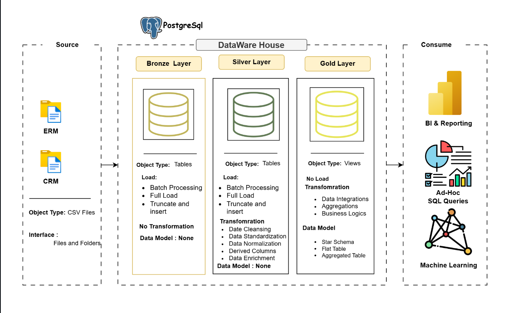

# Data Warehouse and Analytics Project
Welcome to the Data Warehouse and Analytics Project repository! 🚀
This project demonstrates a comprehensive data warehousing and analytics solution, from building a data warehouse to generating actionable insights. Designed as a portfolio project, it highlights industry best practices in data engineering and analytics.

🏗️ <h2>Data Architecture</h2>
The data architecture for this project follows Medallion Architecture Bronze, Silver, and Gold layers: Data Architecture

Bronze Layer: Stores raw data as-is from the source systems. Data is ingested from CSV Files into SQL Server Database. 
Silver Layer: This layer includes data cleansing, standardization, and normalization processes to prepare data for analysis.
Gold Layer: Houses business-ready data modeled into a star schema required for reporting and analytics.

